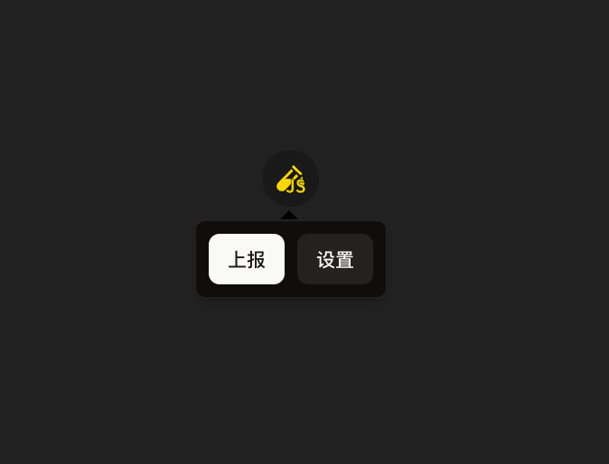
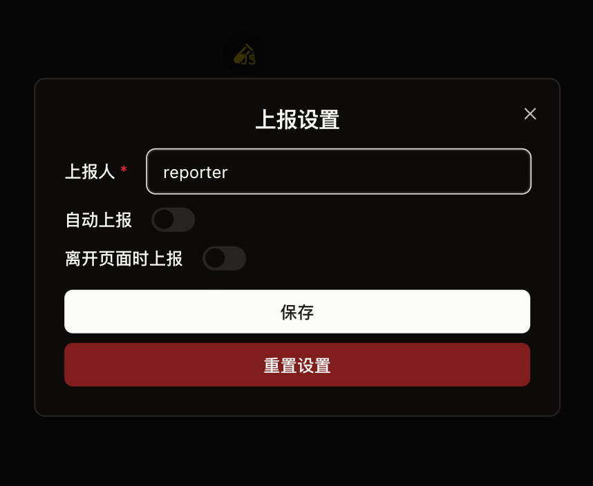
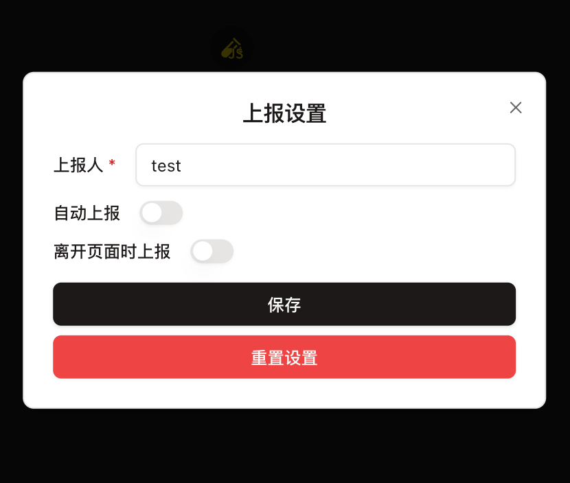

# istanbul-widget

> 收集 istanbul 代码覆盖率的web小组件

如果你使用vite作为开发框架，推荐使用 `vite-plugin-istanbul-widget`

## 上手

### 方法一：使用 npm

```bash
npm install istanbul-widget
```

```ts
import { IstanbulWidget } from 'istanbul-widget'

const istanbulWidget = new IstanbulWidget({
  defaultPosition: {
    x: 0,
    y: 100,
  },
  plugin: {
    // 上报按钮
    report: {
      async onReport(coverage) {
        console.log('上报', coverage)
        // throw new Error('上报失败') // 你可以控制失败的逻辑
      },
    },
    // 设置插件
    setting: {
      requireReporter: true,
    },
    buttonGroup: [
      {
        text: '自定义按钮',
        onClick(...args) {
          console.log(...args)
        },
      },
    ],
  },
})
```

### 方法二：使用CDN直接插入到HTML

```html
<script src="https://unpkg.com/istanbul-widget@latest/dist/istanbul-widget.min.js"></script>
<script>
  // 默认会挂载到 `window.IstanbulWidget` 上
  const istanbulWidget = new window.IstanbulWidget();
</script>
```

## 配置项

```ts
interface IstanbulWidgetOptions {
  /**
   * 主题色
   * @default 'dark'
   */
  theme?: 'light' | 'dark'
  /**
   * 挂载DOM
   * @default document.body
   */
  target?: string | HTMLElement
  /**
   * 按钮悬浮
   * @description false 则关闭悬浮
   */
  float?: {
    offsetX?: number
  } | false
  /**
   * 按钮默认位置
   * @default
   * ```js
   * { x: 0, y: 0 }
   * ```
   */
  defaultPosition?: {
    x?: number
    y?: number
  }

  /**
   * 控件就绪时回调
   */
  onReady?: () => void

  /**
   * 默认开启的插件
   */
  defaultPlugins?: ('setting' | 'buttonGroup')[]

  /**
   * 插件设置
   */
  plugin?: {
    /**
     * 上报插件（核心）
     */
    report: ReportOptions
    /**
     * 设置插件
     */
    setting?: SettingOptions
    /**
     * button组插件
     * @description 内置暴露了一组按钮插件，方便扩展
     */
    buttonGroup?: ButtonGroupOptions
  }
  /**
   * 插件顺序
   */
  pluginOrder?: (PluginName | string)[]
  /**
   * 打印调试信息
   * @default false
   */
  debug?: boolean
}
```

## 编写插件

支持 react插件 和 原生html+dom插件

```tsx
import { IstanbulWidget } from 'istanbul-widget'
import { Button } from 'istanbul-widget/components'

function ReactPlugin() {
  return <Button size={'sm'}>this is react Plugin</Button>
}

// 自定义react插件
const reactPlugin = new IstanbulWidget.IstanbulWidgetReactPlugin('react_plugin', 'React Plugin', ReactPlugin)

reactPlugin.on('init', () => {
  console.log('react plugin inited')
})

// 自定义html插件
const htmlEl = document.createElement('div')
htmlEl.innerHTML = 'this is html plugin'
const htmlPlugin = new IstanbulWidget.IstanbulWidgetPlugin('html_plugin', 'HTML Plugin', htmlEl)

htmlPlugin.on('init', () => {
  console.log('html plugin inited')
})

const istanbulWidget = new IstanbulWidget({
  defaultPosition: {
    x: 0,
    y: 100,
  },
  plugin: {
    // 上报按钮
    report: {
      onReport(coverage) {
        console.log('上报', coverage)
        throw new Error('上报失败')
      },
    },
    // 设置插件
    setting: {
      requireReporter: true,
    },
    buttonGroup: [
      {
        text: '额外按钮 - 1',
        onClick() {
          console.log('1')
        },
      },
    ],
  },
})

istanbulWidget.addPlugin(reactPlugin)
istanbulWidget.addPlugin(htmlPlugin)
```

## 截图

### 入口按钮


### 深色主题


### 浅色主题

